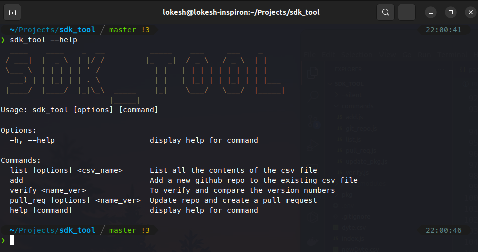

[](https://classroom.github.com/online_ide?assignment_repo_id=7944740&assignment_repo_type=AssignmentRepo)
<div id="top"></div>


<!-- PROJECT LOGO -->
<br />
<div align="center">
  <a href="https://github.com/dyte-submissions/dyte-vit-2022-MishraLokesh">
    
  </a>

<h3 align="center">My_Dependabot</h3>

  <p align="center">
    A CLI tool to keep your dependencies up to date.<br>It checks your dependency files for outdated requirements and opens individual PRs for any it finds.
    <br />
    <a href="https://www.npmjs.com/package/sdk_tool__lokeshmishra"><strong>Explore the tool as a NPM package»</strong></a>
    <br />
    <br />
    <a href="https://drive.google.com/drive/folders/1gVUOrAq3DDapNVdH4sKVcqVPHDwynkhd?usp=sharing">View Demo</a>
    ·
    <a href="https://github.com/dyte-submissions/dyte-vit-2022-MishraLokesh">Report Bug</a>
    ·
    <a href="https://github.com/dyte-submissions/dyte-vit-2022-MishraLokesh">Request Feature</a>
  </p>
</div>


<!-- TABLE OF CONTENTS -->
<details>
  <summary>Table of Contents</summary>
  <ol>
    <li>
      <a href="#about-the-project">About The Project</a>
      <ul>
        <li><a href="#built-with">Built With</a></li>
      </ul>
    </li>
    <li>
      <a href="#getting-started">Getting Started</a>
      <ul>
        <li><a href="#prerequisites">Prerequisites</a></li>
        <li><a href="#installation">Installation</a></li>
      </ul>
    </li>
    <li><a href="#usage">Usage</a></li>
    <li><a href="#roadmap">Roadmap</a></li>
    <li><a href="#contributing">Contributing</a></li>
    <li><a href="#license">License</a></li>
    <li><a href="#contact">Contact</a></li>
    <li><a href="#acknowledgments">Acknowledgments</a></li>
  </ol>
</details>
    <br />


<!-- ABOUT THE PROJECT -->
## About The Project

This tool helps to keep the dependencies up to date, by generating a pull request to the project with a newer version. 

<p align="right">(<a href="#top">back to top</a>)</p>


<!-- WHAT'S UNIQUE IN MY WORK -->
## <a href="./test.md">What's unique in my work?</a> 


<p align="right">(<a href="#top">back to top</a>)</p>

### Built With

* [Commander.js](https://www.npmjs.com/package/commander)
* [Node.js](https://nodejs.org/en/)
* [JavaScript](https://developer.mozilla.org/en-US/docs/Web/JavaScript)

<p align="right">(<a href="#top">back to top</a>)</p>


<!-- GETTING STARTED -->
## Getting Started

This is an example of how you may give instructions on setting up your project locally.
To get a local copy up and running follow these simple example steps.

### Prerequisites

This is an example of how to list things you need to use the software and how to install them.
* npm
  ```sh
  npm install npm@latest -g
  ```
### Installation

Clone the repository:

```
git clone https://github.com/MishraLokesh/My_Dependabot.git
```

Install the dependencies:

```
npm i
```

Install the package globally on your machine:

```
npm i --location=global sdk_tool__lokeshmishra --force
```
And sometimes, it's required to install the developer dependency if certain error pops up

```
sudo npm i -g @octokit/core
```


<p align="right">(<a href="#top">back to top</a>)</p>


<!-- USAGE EXAMPLES -->
## Usage

After installation, the sdk_tool is ready to be used
#
The test csv file 'test.csv' is already there.
Only change to me made is the GitHub username and Bearer Token in .env file. Currently they are set to mine, in order to fork and generate a pull request from there
#

_For more examples, please refer to the [Documentation](https://example.com)_

1. To view the input csv provided:

```
sdk_tool list -i "name.csv"
```

2. To add more repository informations on top of csv:

```
sdk_tool add
```

For example:

```
sdk_tool add
Enter the name of the repository: 
Enter the link of the repository: 
```

This continues until the user wants to exit explicitly by pressing 'ctrl+c'

3. Verify the version number with the version provided:

```
sdk_tool verify "dependancy_name@version_number"
```

This will verify the version number of each repository provided in the csv file with the version number provided of the respective dependency

```
sdk_tool pull_req "dependancy_name@version_number" -update
```

where `-u, -update` can take at least one value. Values are separated by spaces.
This will fetch the package.json file of those repositories which are out of date, and fork the repository, make changes to the remote repository, and then generate a pull request to the original repository

<p align="right">(<a href="#top">back to top</a>)</p>

<!-- FUTURE WORK -->
## Future Work
For future work, there can be a lot of options to implement
* Make the entire process automated, so it can automatically check the version and inform the user about it.
* Check the status of the pull request and inform the request generator, once the pull request is accepted.

<!-- ROADMAP -->
## Roadmap

- [*] Feature 1 - To input the csv file and display it's content in tabular format
- [*] Feature 2 - To compare the dependancy version number for each repository and display in a tabular format
- [*] Feature 3 - To change the contents of the version number and generate a pull request
    - [*] EXTRA Feature - To add more repositories information in the existing csv before proceeding further

See the [open issues](https://github.com/dyte-submissions/dyte-vit-2022-MishraLokesh/issues) for a full list of proposed features (and known issues).

<p align="right">(<a href="#top">back to top</a>)</p>


<!-- CONTRIBUTING -->
## Contributing

Contributions are what make the open source community such an amazing place to learn, inspire, and create. Any contributions you make are **greatly appreciated**.

If you have a suggestion that would make this better, please fork the repo and create a pull request. You can also simply open an issue with the tag "enhancement".
Don't forget to give the project a star! Thanks again!

1. Fork the Project
2. Create your Feature Branch (`git checkout -b feature/AmazingFeature`)
3. Commit your Changes (`git commit -m 'Add some AmazingFeature'`)
4. Push to the Branch (`git push origin feature/AmazingFeature`)
5. Open a Pull Request

<p align="right">(<a href="#top">back to top</a>)</p>


<!-- LICENSE -->
## License

Distributed under the MIT License. See `LICENSE.txt` for more information.

<p align="right">(<a href="#top">back to top</a>)</p>


<!-- CONTACT -->
## Contact

Lokesh Mishra<br>
lokesh.mishra2019@vitstudent.ac.in<br>
https://www.linkedin.com/in/lokesh-mishra-0807/


Project Link - https://github.com/MishraLokesh/My_Dependabot.git

<p align="right">(<a href="#top">back to top</a>)</p>

